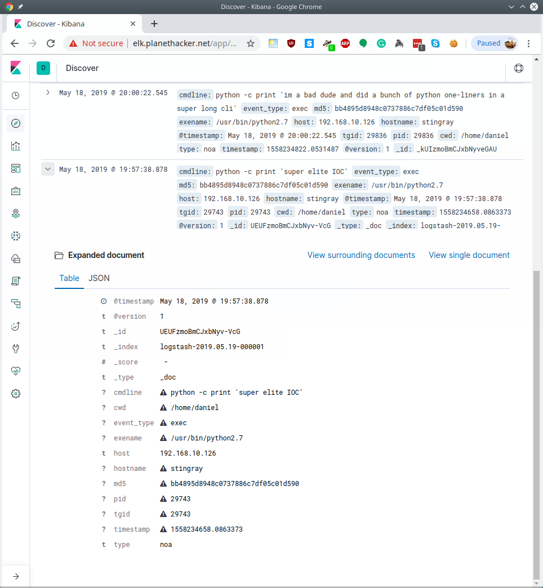

# noawareness - process creation/destruction and filesystem monitoring

https://github.com/droberson/noawareness

This tool uses a netlink socket to monitor process creation. It attempts to pull information
such as the executed file's md5 hash, the command line used to invoke said commands, and
the environment. It also uses the inotify facility to monitor filesystem events for
specified files.

This data is then bundled up as a JSON object and shipped to a remote log viewer. This makes
looking at it with ELK or something similar very easy:

We can pipe this data through scripts to do things like issue an alert if a known bad
command has been run, if they are using really long cli arguments (python -c, bash -c, ...),
etc.

## compiling
Install openssl-dev and libjson-c-dev, then _make_. This will make a static-linked binary.

There is also a watchdog script included, meant to be run via crontab to restart this if it
fails or gets killed.
